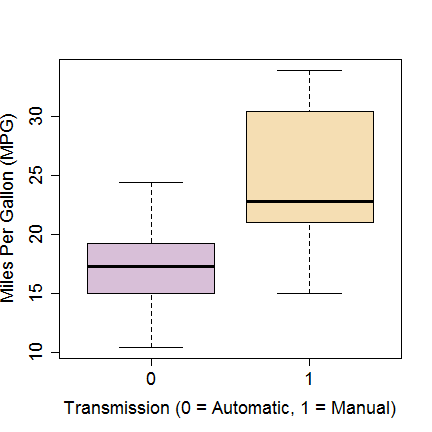
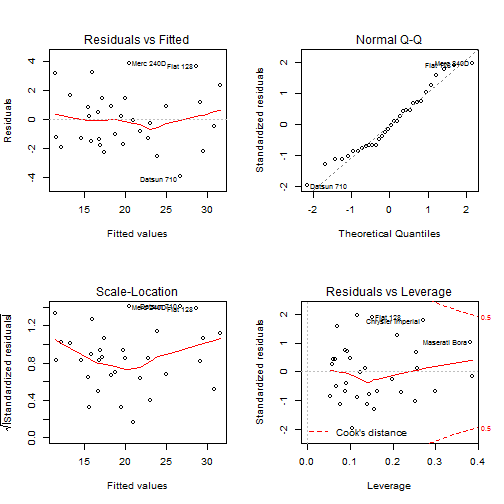
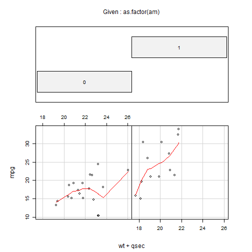

## Automatic or Manual transmission for better fuel efficiency?
===============================================================

### Executive Summary
In this report we examined data from 32 cars, 1973-1974 models, to ascertain if
an automatic or manual transmission is better with regards to fuel consumption.
Data used in this report is from the 1974 Motor Trend US magazine and 
details can be found on R CRAN
[here](http://stat.ethz.ch/R-manual/R-devel/library/datasets/html/mtcars.html).
Our initial analysis found that manual cars seem to be more efficient than 
automatic cars. However, when interactions between other aspects of automobile 
design are taken into consideration, it is found that weight and 
acceleration play a significant role.


### Sample Distribution: T Test
The initial comparison is simply the summary statistics between automatic 
and manual. It is found that manual cars are more efficient, average of 
24.39 &#177; 6.17 mpg, than automatic cars, average 
of 17.15 &#177; 3.83 mpg (see box plot in section\#1 in appendix).

The two-tailed Student's T-Test for the groups confirms that automatic and 
manual cars are drawn from populations with different means (95% CI).

```r
data(mtcars)

manual <- as.list(subset(mtcars, am == 1, select = mpg))[[1]]
automatic <- as.list(subset(mtcars, am == 0, select = mpg))[[1]]

t.test(manual, automatic)
```

```
## 
## 	Welch Two Sample t-test
## 
## data:  manual and automatic
## t = 3.767, df = 18.33, p-value = 0.001374
## alternative hypothesis: true difference in means is not equal to 0
## 95 percent confidence interval:
##   3.21 11.28
## sample estimates:
## mean of x mean of y 
##     24.39     17.15
```


However, note that each car has different sets of automobile design parameters 
and there are likely multiple factors that influence fuel mileage. A more
accurate model encompassing interactions amongst the various factors is required
to better describe the fuel efficiency of a car.

### Model Selection
A subset of parameters most relevant to mpg must be determined. To better achieve 
a balance between a best fit and a small variance inflation a stepwise model 
selection is used. Since our primary interest is in the influence of type of
transmission, this variable and all its interactions are included in the model
selection.

```r
var <- colnames(mtcars)[!(colnames(mtcars) %in% c("mpg", "am"))]
formula.full <- formula(paste("mpg ~ factor(am):(", paste(var, collapse = "*"), 
    ")"))

null = lm(mpg ~ 1, data = mtcars)
full = lm(formula.full, data = mtcars)

model <- step(null, scope = list(lower = null, upper = full), direction = "both", 
    trace = FALSE)
model$call
```

```
## lm(formula = mpg ~ factor(am):wt + factor(am):qsec, data = mtcars)
```

Note that the weight of the car and the quarter-mile-time (`qsec`) 
signficantly impact the `mpg` for each type of transmission. 

### Model Validation
A residual analysis was done to validate the regression model. To qualify as a 
good model, the residuals must be, (1) Normal with 0 mean and constant variance
(2) Independent, no autocorrelation (iid). Section #2 in the appendix shows a 
plot summary of the residuals of the model. The "Residuals vs Fitted" and 
"Scale-Location" charts show that there is no trend to the residuals. 
The Q-Q plot shows that the the errors are approximately normally distributed.

### Model Interpretation

```r
summary(model)
```

```
## 
## Call:
## lm(formula = mpg ~ factor(am):wt + factor(am):qsec, data = mtcars)
## 
## Residuals:
##    Min     1Q Median     3Q    Max 
## -3.936 -1.402 -0.155  1.269  3.886 
## 
## Coefficients:
##                  Estimate Std. Error t value Pr(>|t|)    
## (Intercept)        13.969      5.776    2.42   0.0226 *  
## factor(am)0:wt     -3.176      0.636   -4.99  3.1e-05 ***
## factor(am)1:wt     -6.099      0.969   -6.30  9.7e-07 ***
## factor(am)0:qsec    0.834      0.260    3.20   0.0035 ** 
## factor(am)1:qsec    1.446      0.269    5.37  1.1e-05 ***
## ---
## Signif. codes:  0 '***' 0.001 '**' 0.01 '*' 0.05 '.' 0.1 ' ' 1
## 
## Residual standard error: 2.1 on 27 degrees of freedom
## Multiple R-squared:  0.895,	Adjusted R-squared:  0.879 
## F-statistic: 57.3 on 4 and 27 DF,  p-value: 8.42e-13
```

See Section #3 in the appendix for a co-plot of parameters in the model by 
transmission type.   

#### For constant quarter-mile-time (qsec): 
For each unit of increase in weight (1 unit = 1000lb) there is a 3.176 mpg 
**decrease** for automatic cars while there is a 6.099 mpg **decrease** for 
manual cars.  This makes physical sense as heavier cars in general would require
more fuel.

#### For constant weight (lb/1000):
For each unit of increase in quarter-mile-time (1 unit = 1 sec), there is a 
0.834 mpg increase for automatic cars while there is 1.446 mpg increase 
for manual cars. 

### Concluding Remarks
We cannot make the general conclusion that manual cars are more fuel efficient.
The above analysis seems to indicate that for heavier cars a automatic 
transmission is more fuel efficient. For cars with greater quarter-mile-time 
(slower acceleration) manual transmission is more efficient.

## APPENDIX: PLOTS
### 1. Boxplot (`am`) vs `mpg`
 


### 2. Residuals: `model`
 


### 3. CoPlot: Fit by transmission type (`am`)
 


```
## 
## 
## processing file: course-project.Rmd
## output file: course-project.md
```

